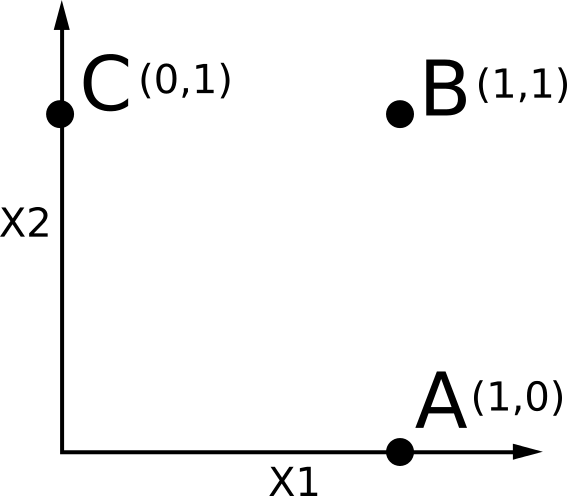

<!-- to do: set seed for debugging purposes -->

We simulate an agent that has a choice between 3 options in a 2-dimensional space.

{:width="200px"}

The agent's utility function has a coefficient `ci` for each dimension `Xi`. Either the dimension is good for the agent `(ci=1)` or the dimension doesn't matter `(ci=0)`. So for any point in the space `(x1,x2)`, the utility for the agent is `c1*x1 + c2*x2`.

Suppose the actual world is one in which the agent cares about dimension `X1` `(c1=1)` but doesn't care about dimension `X2` `(c2=0)`. Then both A and B are good actions for the agent in the actual world. The agent will choose either A or B. (For now we keep the agent very rational, with `lambda=100`).

~~~
///fold:
var infer = function(fn) {return Infer({method: 'enumerate'}, fn); };

// state choices
var states = {
	A: {x1: 1, x2: 0},
	B: {x1: 1, x2: 1},
	C: {x1: 0, x2: 1}
};

// utility function just weighs the dimensions of the state by the coefficients
var utility = function(state, coefficents) {
	return coefficents.c1 * state.x1 +
		coefficents.c2 * state.x2;
};

// very rational agent
var lambda = 100;

var determineAction = infer(function() {
	// sample a state at uniform - no prior costs to options
	var stateLabel = uniformDraw(['A', 'B', 'C']);
	var state = states[stateLabel];

	// weight states by utility
	// calculate utilities of states based on your coefficients.
	factor(lambda * utility(state, {c1: 1, c2: 0}));

	return stateLabel;
});
///

viz.auto(determineAction);
~~~

We can rewrite this so that the random choices are extracted into completely independent random variables and the coefficients in the utility function have priors, so it's easy to counterfactualize over. (We've introduced a little bit of noise with `discreteUniform` so the probabilities might be a little bit uneven now.)

~~~
///fold:
// some utilities
var infer = function(fn) {return Infer({method: 'enumerate'}, fn); };
var probability = function(dist, value) {return Math.exp(dist.score(value));};
var sampleWithUniformRV = function(dist, uniformRV) {
	var support = dist.support();
	var check = function(elems, probabilityMassSoFar) {
		var elemToCheck = first(elems);
		if (elems.length==1) {return elemToCheck;}
		var probabilityMass = probabilityMassSoFar + probability(dist, elemToCheck);
		if (uniformRV < probabilityMass) {
			return elemToCheck;
		} else {
			var elemsRemaining = rest(elems);
			return check(elemsRemaining, probabilityMass);
		}
	};
	check(support, 0);
};

// very rational agent
var lambda = 100;

// ----------------------- utility program specification -----------------------

// state choices
var states = {
	A: {x1: 1, x2: 0},
	B: {x1: 1, x2: 1},
	C: {x1: 0, x2: 1}
};

// priors on coefficients in utility function
var coefPrior = function() {
	// care or don't care about a dimension
	return uniformDraw([0, 1]);
};

var discreteUniform = Infer({method: 'rejection', samples: 1000}, function() {
  return uniform(0, 1);
});

// utility function just weighs the dimensions of the state by the coefficients
var utility = function(state, coefficents) {
	return coefficents.c1 * state.x1 +
		coefficents.c2 * state.x2;
};

var determineAction = function(args) {
	// get action from posterior given an independent randomness variable "actionRandomness"
	var coefs = args.coefs;
	var actionRandomness = args.actionRandomness;

	// produces a posterior on actions based on the utilities of its possible actions
	var actionPosterior = infer(function() {
		// sample a state at uniform - no prior costs to options
		var stateLabel = uniformDraw(['A', 'B', 'C']);
		var state = states[stateLabel];

		// weight states by utility
		// calculate utilities of states based on your coefficients.
		factor(lambda * utility(state, coefs));

		return stateLabel;
	});

	var action = sampleWithUniformRV(actionPosterior, actionRandomness);

	return action;
};

var independentLatentsModel = function() {
	// to do: eventually insert checks that these are independent
	// these variables are either explanations, with their priors so we can counterfactualize
	// or unkown, unobservable sources of randomness
	return {
		actionRandomness: sample(discreteUniform),
		c1: coefPrior(),
		c2: coefPrior()
	}
};
var observablesModel = function(independentLatents) {
	var actionRandomness = independentLatents.actionRandomness;
	var c1 = independentLatents.c1;
	var c2 = independentLatents.c2;
	var coefs = {c1: c1, c2: c2};
	var action = determineAction({coefs: coefs, actionRandomness: actionRandomness});
	return {
		c1: c1,
		c2: c2,
		action: action
	}
};
///

viz.auto(
	infer(function() {
		var latents = independentLatentsModel();
		var observables = observablesModel(latents);
		condition(latents.c1==1);
		condition(latents.c2==0);
		return observables.action;
	})
);
~~~

We're defining the explanation "A because c2=0" to be "Counterfactually, if c2 had not been 0, then the action would not have been A".

We can also focus the explanation on a particular alternative value, for example, "A (and not B) because c2=0" would mean "Counterfactually, if c2 had not been 0, then the action would have been B instead of A."

The implementations of these counterfactuals:

~~~
///fold:
// some utilities
var infer = function(fn) {return Infer({method: 'enumerate'}, fn); };
var probability = function(dist, value) {return Math.exp(dist.score(value));};
var sampleWithUniformRV = function(dist, uniformRV) {
	var support = dist.support();
	var check = function(elems, probabilityMassSoFar) {
		var elemToCheck = first(elems);
		if (elems.length==1) {return elemToCheck;}
		var probabilityMass = probabilityMassSoFar + probability(dist, elemToCheck);
		if (uniformRV < probabilityMass) {
			return elemToCheck;
		} else {
			var elemsRemaining = rest(elems);
			return check(elemsRemaining, probabilityMass);
		}
	};
	check(support, 0);
};
var score = function(dist, value) {
	if (dist.support().indexOf(value) == -1) {
		// the actual value would "definitely" not happen
		return -Infinity;
	} else {
		return dist.score(value);
	}
};

// very rational agent
var lambda = 100;

// ----------------------- utility program specification -----------------------

// state choices
var states = {
	A: {x1: 1, x2: 0},
	B: {x1: 1, x2: 1},
	C: {x1: 0, x2: 1}
};

// priors on coefficients in utility function
var coefPrior = function() {
	// care or don't care about a dimension
	return uniformDraw([0, 1]);
};

var discreteUniform = infer(function() {
	return uniformDraw([0.1, 0.2, 0.3, 0.4, 0.5, 0.6, 0.7, 0.8, 0.9]);
});

// utility function just weighs the dimensions of the state by the coefficients
var utility = function(state, coefficents) {
	return coefficents.c1 * state.x1 +
		coefficents.c2 * state.x2;
};

var determineAction = function(args) {
	// get action from posterior given an independent randomness variable "actionRandomness"
	var coefs = args.coefs;
	var actionRandomness = args.actionRandomness;

	// produces a posterior on actions based on the utilities of its possible actions
	var actionPosterior = infer(function() {
		// sample a state at uniform - no prior costs to options
		var stateLabel = uniformDraw(['A', 'B', 'C']);
		var state = states[stateLabel];

		// weight states by utility
		// calculate utilities of states based on your coefficients.
		factor(lambda * utility(state, coefs));

		return stateLabel;
	});

	var action = sampleWithUniformRV(actionPosterior, actionRandomness);

	return action;
};

var independentLatentsModel = function() {
	// to do: eventually insert checks that these are independent
	// these variables are either explanations, with their priors so we can counterfactualize
	// or unkown, unobservable sources of randomness
	return {
		actionRandomness: sample(discreteUniform),
		c1: coefPrior(),
		c2: coefPrior()
	}
};
var observablesModel = function(independentLatents) {
	var actionRandomness = independentLatents.actionRandomness;
	var c1 = independentLatents.c1;
	var c2 = independentLatents.c2;
	var coefs = {c1: c1, c2: c2};
	var action = determineAction({coefs: coefs, actionRandomness: actionRandomness});
	return {
		c1: c1,
		c2: c2,
		action: action
	}
};

// ----------------------- counterfactualization -----------------------

var counterfactualizeLatents = function(model, actual) {
	var s = 0.53; //stickiness
	var totallyDifferent = model();

	return mapObject(function(key, value) {
		return flip(s) ? actual[key] : totallyDifferent[key];
	}, actual);
}

var counterfactually = function(args) {
	var actualObservations = args.actualObservations;
	var ifTheseThingsHadBeenTrue = args.ifTheseThingsHadBeenTrue ? args.ifTheseThingsHadBeenTrue : null;
	var ifThisFunctionHadBeenTrue = args.ifThisFunctionHadBeenTrue ? args.ifThisFunctionHadBeenTrue : null;
	var thenThisVariable = args.thenThisVariable;
	var wouldHaveBeen = args.wouldHaveBeen ? args.wouldHaveBeen : null;
	var wouldNotHaveBeen = args.wouldNotHaveBeen ? args.wouldNotHaveBeen : null;

	return infer(function() {

		// generate an actual world (with latent random states)
		// conditioned on actual observables
		var actualLatents = independentLatentsModel();
		var actualObservables = observablesModel(actualLatents);
		// for each observation, confirm it has that value
		mapObject(function(key, value) {
			condition(actualObservables[key]==value);
		}, actualObservations);

		// generate a conterfactual world
		// hooked to the generated actual world
		var cfLatents = counterfactualizeLatents(independentLatentsModel, actualLatents);
		var cfObservables = observablesModel(cfLatents);

		// conditioned on the counterfactual premise
		if (ifTheseThingsHadBeenTrue) {
			mapObject(function(key, value) {
				condition(cfObservables[key]==value);
			}, ifTheseThingsHadBeenTrue);
		} else {
			condition(ifThisFunctionHadBeenTrue(cfObservables));
		}

		// return the counterfactual query
		if (wouldHaveBeen) {
			return cfObservables[thenThisVariable]==wouldHaveBeen;
		} else if (wouldNotHaveBeen) {
			return cfObservables[thenThisVariable]!=wouldNotHaveBeen;
		} else {
			// just return the full posterior of the query's values
			return cfObservables[thenThisVariable];
		}
	});
};
///

var actualObservations = {c1: 1, c2: 0, action: 'A'};

print("if the agent had cared about x2, it would have chosen B (1,1)")
print(probability(counterfactually({
	ifTheseThingsHadBeenTrue: {c2: 1},
	actualObservations: actualObservations,
	thenThisVariable: 'action',
	wouldHaveBeen: 'B'
}), true));

print("if the agent had not cared about x1, it might have chosen B (1,1)")
print(probability(counterfactually({
	ifTheseThingsHadBeenTrue: {c1: 0},
	actualObservations: actualObservations,
	thenThisVariable: 'action',
	wouldHaveBeen: 'B'
}), true));
~~~

And finally, we can wrap this in a speaker function that chooses an explanation.

~~~
///fold:

// some utilities
var infer = function(fn) {return Infer({method: 'enumerate'}, fn); };
var probability = function(dist, value) {return Math.exp(dist.score(value));};
var sampleWithUniformRV = function(dist, uniformRV) {
	var support = dist.support();
	var check = function(elems, probabilityMassSoFar) {
		var elemToCheck = first(elems);
		if (elems.length==1) {return elemToCheck;}
		var probabilityMass = probabilityMassSoFar + probability(dist, elemToCheck);
		if (uniformRV < probabilityMass) {
			return elemToCheck;
		} else {
			var elemsRemaining = rest(elems);
			return check(elemsRemaining, probabilityMass);
		}
	};
	check(support, 0);
};
var score = function(dist, value) {
	if (dist.support().indexOf(value) == -1) {
		// the actual value would "definitely" not happen
		return -Infinity;
	} else {
		return dist.score(value);
	}
};

// very rational agent
var lambda = 100;

// ----------------------- utility program specification -----------------------

// state choices
var states = {
	A: {x1: 1, x2: 0},
	B: {x1: 1, x2: 1},
	C: {x1: 0, x2: 1}
};

// priors on coefficients in utility function
var coefPrior = function() {
	// care or don't care about a dimension
	return uniformDraw([0, 1]);
};

var discreteUniform = infer(function() {
	return uniformDraw([0.1, 0.2, 0.3, 0.4, 0.5, 0.6, 0.7, 0.8, 0.9]);
});

// utility function just weighs the dimensions of the state by the coefficients
var utility = function(state, coefficents) {
	return coefficents.c1 * state.x1 +
		coefficents.c2 * state.x2;
};

var determineAction = function(args) {
	// get action from posterior given an independent randomness variable "actionRandomness"
	var coefs = args.coefs;
	var actionRandomness = args.actionRandomness;

	// produces a posterior on actions based on the utilities of its possible actions
	var actionPosterior = infer(function() {
		// sample a state at uniform - no prior costs to options
		var stateLabel = uniformDraw(['A', 'B', 'C']);
		var state = states[stateLabel];

		// weight states by utility
		// calculate utilities of states based on your coefficients.
		factor(lambda * utility(state, coefs));

		return stateLabel;
	});

	var action = sampleWithUniformRV(actionPosterior, actionRandomness);

	return action;
};

var independentLatentsModel = function() {
	// to do: eventually insert checks that these are independent
	// these variables are either explanations, with their priors so we can counterfactualize
	// or unkown, unobservable sources of randomness
	return {
		actionRandomness: sample(discreteUniform),
		c1: coefPrior(),
		c2: coefPrior()
	}
};
var observablesModel = function(independentLatents) {
	var actionRandomness = independentLatents.actionRandomness;
	var c1 = independentLatents.c1;
	var c2 = independentLatents.c2;
	var coefs = {c1: c1, c2: c2};
	var action = determineAction({coefs: coefs, actionRandomness: actionRandomness});
	return {
		c1: c1,
		c2: c2,
		action: action
	}
};

// ----------------------- counterfactualization -----------------------

var counterfactualizeLatents = function(model, actual) {
	var s = 0.53; //stickiness
	var totallyDifferent = model();

	return mapObject(function(key, value) {
		return flip(s) ? actual[key] : totallyDifferent[key];
	}, actual);
}

var counterfactually = function(args) {
	var actualObservations = args.actualObservations;
	var ifTheseThingsHadBeenTrue = args.ifTheseThingsHadBeenTrue ? args.ifTheseThingsHadBeenTrue : null;
	var ifThisFunctionHadBeenTrue = args.ifThisFunctionHadBeenTrue ? args.ifThisFunctionHadBeenTrue : null;
	var thenThisVariable = args.thenThisVariable;
	var wouldHaveBeen = args.wouldHaveBeen ? args.wouldHaveBeen : null;
	var wouldNotHaveBeen = args.wouldNotHaveBeen ? args.wouldNotHaveBeen : null;

	return infer(function() {

		// generate an actual world (with latent random states)
		// conditioned on actual observables
		var actualLatents = independentLatentsModel();
		var actualObservables = observablesModel(actualLatents);
		// for each observation, confirm it has that value
		mapObject(function(key, value) {
			condition(actualObservables[key]==value);
		}, actualObservations);

		// generate a conterfactual world
		// hooked to the generated actual world
		var cfLatents = counterfactualizeLatents(independentLatentsModel, actualLatents);
		var cfObservables = observablesModel(cfLatents);

		// conditioned on the counterfactual premise
		if (ifTheseThingsHadBeenTrue) {
			mapObject(function(key, value) {
				condition(cfObservables[key]==value);
			}, ifTheseThingsHadBeenTrue);
		} else {
			condition(ifThisFunctionHadBeenTrue(cfObservables));
		}

		// return the counterfactual query
		if (wouldHaveBeen) {
			return cfObservables[thenThisVariable]==wouldHaveBeen;
		} else if (wouldNotHaveBeen) {
			return cfObservables[thenThisVariable]!=wouldNotHaveBeen;
		} else {
			// just return the full posterior of the query's values
			return cfObservables[thenThisVariable];
		}
	});
};

var actualObservations = {c1: 1, c2: 0, action: 'A'};

// ----------------------- explanation -----------------------

var falsifyExplanation = function(explanation, actualObservations) {
	if (explanation == 'c1' | explanation == 'c2') {
		return function(cfObservables) {
			return cfObservables[explanation] != actualObservations[explanation];
		}
	} else if (explanation == 'c1 and c2 independently') {
		return function(cfObservables) {
			return (cfObservables.c1 != actualObservations.c1 &
				cfObservables.c2 != actualObservations.c2)==1;
		}
	} else if (explanation == 'c1 and c2 jointly') {
		return function(cfObservables) {
			return (cfObservables.c1 != actualObservations.c1 |
				cfObservables.c2 != actualObservations.c2) == 1;
		}
	}
};

var why = function(args) {
	var variableToExplain = args.variableToExplain;
	var causeIThoughtItWouldBe = args.causeIThoughtItWouldBe ? args.causeIThoughtItWouldBe : null;
	var possibleExplanations = args.possibleExplanations;
	var actualObservations = args.actualObservations;

	return infer(function() {
		var explanation = uniformDraw(possibleExplanations);

		// counterfactually if not explanation,
		// then "variableToExplain" would be different
		// (and might have been "causeIThoughtItWouldBe")
		var ifExplanationWereFalse = falsifyExplanation(explanation, actualObservations);
		var ifNotExplanationCounterfactual = counterfactually({
			ifThisFunctionHadBeenTrue: ifExplanationWereFalse,
			actualObservations: actualObservations,
			thenThisVariable: variableToExplain,
			wouldHaveBeen: causeIThoughtItWouldBe ? causeIThoughtItWouldBe : null,
			wouldNotHaveBeen: actualObservations[variableToExplain]
		});
		factor(score(ifNotExplanationCounterfactual, true));

		// return "because " + explanation + "=" + actualObservations[explanation];
		return explanation + "=" + actualObservations[explanation];
	});
}
///

print("Why A?");
// why A?
// because if not ___ then not A.
viz.auto(why({
	variableToExplain: 'action',
	possibleExplanations: ['c1', 'c2'],
	actualObservations: {action: 'A', c1: 1, c2: 0}
}));

print("Why A (and not B)?")
// why A and not B?
viz.auto(why({
	variableToExplain: 'action',
	causeIThoughtItWouldBe: 'B',
	possibleExplanations: ['c1', 'c2'],
	actualObservations: {action: 'A', c1: 1, c2: 0}
}));

print("Why A (and not C)?")
// why A and not C?
viz.auto(why({
	variableToExplain: 'action',
	causeIThoughtItWouldBe: 'C',
	possibleExplanations: ['c1', 'c2'],
	actualObservations: {action: 'A', c1: 1, c2: 0}
}));

'finished';
~~~
